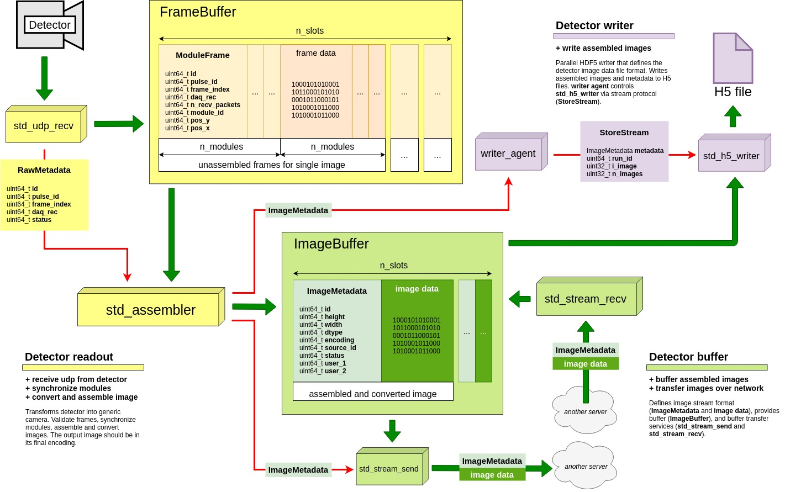
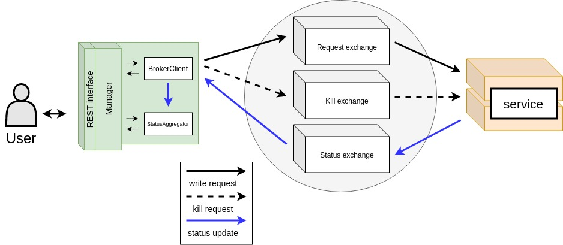

# std_daq_service

This is a monorepo for standard daq services.

Documentation of interfaces:
- [SLS Rest interface](std_daq_service/rest/README.md)
- [Broker command line interface](std_daq_service/tools/README.md)

Documentation of services:
- [Writer agent](std_daq_service/writer_driver/README.md)
- [Epics buffer](std_daq_service/epics/buffer/README.md)
- [Epics writer](std_daq_service/epics/writer/README.md)

## Getting started

### Setup development environment
For development and testing you need to have **Docker** and **docker-compose** installed. You must run 
Redis and RabbitMQ in order to run unit tests. To start them, from the root folder of the project, execute:
```bash
sh setup_dev_env.sh
```
This will bring up both services on your local machine and populate Redis with test configurations 
(located in **tests/redis\_configs/\[service\_name\].json**). You can now execute the unit tests from your local 
dev environment or you can use the provided docker container.

To manually setup your local paths (if your IDE does not do that already):
```bash
python setup.py develop
```

You manually install the required Python modules:
```bash
conda install -c conda-forge --yes --file docker/requirements.txt
```

### Running unit tests
To run the tests in a docker container, execute from the root of the project:
```bash
sh tests_in_docker.sh
```
(Please note that at the moments the test container uses host networking, so you might have problems on a Mac - 
you will need to open the needed ports manually.)

If you have set your development environment correctly you can also run the unit tests from your machine. 
In the root folder run:
```bash
python -m unittest discover tests/
```

### Starting a service
Once you have Redis and RabbitMQ running locally you can start the services straight from your machine, but we 
suggest you use the provided docker container for this. 

To run services in the docker container, from the project root:
```bash 
docker run --net=host --rm  \
    -e SERVICE_NAME=debug.buffer \
    -v $(pwd)/tests/redis_configs/debug.buffer.json:/std_daq_service/config.json \
    paulscherrerinstitute/std-daq-service \
    buffer
```

For more information on the parameters of the docker container please check the **Service container** section. 

### Service container
The service container should be used in order to standardize the runtime environment of services. It provides 
standard ways to pass parameters, config files, manage service logs and ship status and configs to Redis.

The environment parameters that can be passed to the container are:
- SERVICE_NAME (unique identifier of the service to run)
- REDIS_HOST (default: 127.0.0.1; Host of the Redis instance)
- REDIS_SKIP (default: False; Skip reporting to Redis - useful for debugging and development)
(in addition, any env parameters directly consumed by the service can be passed as well)

When starting the container you can also map a configuration file to **/std\_daq\_service/config.json**.
If you do not provide a config.json file, the container will try to download it from Redis from the key 
**config.\[service\_name\]**. If no key with this name is present in Redis or you did not provide the config file,
the container will initialize an empty json file. This config file is later loaded by the service.

You can pass environment variables to Docker with the -e flag and you can mount files with the -v flag (both paths 
needs to be absolute, and you must map your config file in the image to **/std\_daq\_service/config.json**)

For more detailed information please consult the [Service container](docker/README.md) page.
## Deployment

The deployment should be made with Docker images. You must copy a specific version of the software into 
a new version of the **std-daq-service** docker image and push it to the registry. The **std-daq-service**
image you build must use the image **std-daq-service-base** base.

If you modified the 

## Architecture overview
An std-daq-service is a micro service that uses **RabbitMQ** for interaction with users and **ZMQ** for data 
streams. The services are built using predefined formats and standard in order to make them part of the 
std-daq platform.

The std-daq is composed by two event flows:

- Detector data flow (images transfer, uses ZMQ for communication)
- User interaction flow (transfer of user requests, uses RabbitMQ for communication)

## Detector data flow



In order from the detector onward, the 3 components involved into this flow are:

- Detector readout (receive detector modules and assemble final images)
- Detector buffer (buffer images and transfer images to other servers)
- Detector writer (write images from buffer to disk)

### Detector readout
The goal of this component is to convert the raw detector frames received via UDP into final images. It transforms 
the detector into a generic camera. By having all detectors standardized on the same interface we can have a common 
std-daq for all PSI facilities.  

In order to achieve this the component must first receive the UDP packets from the detector in **std\_udp\_recv**,
reconstruct the frames and save them into **FrameBuffer**. The frames from all modules are then synchronized into 
a single metadata stream message of **RawMetadata** format that is sent to **std\_assembler**.

The **std\_assembler** takes care of image conversion (background, pedestal, corrections etc.) and assembly of the modules 
into the desired shape. Once the final images are ready, they are saved into the **ImageBuffer** and a stream of 
**ImageMetadata** is sent out to anyone listening.

### Detector buffer
The detector buffer provides a RAM image buffering structure (**ImageBuffer**) and buffer transfer services 
(**std\_stream\_send** and **std\_stream\_recv**) that can be used to transfer the RAM buffering structure to and 
from other servers. The goal of this component is to provide a detector image buffer that can be replicated across 
multiple servers and that allows applications running on the same server to access the detector images without 
additional memory copies.

It defines the **ImageMetadata** stream structure that needs to be implemented by any component that wants to 
communicate operate directly with the buffer.

The **std_stream_recv** broadcasts the metadata of received images in the same way as the **std\_assembler** does
in the **Detector readout** component. Because of this detector image buffer replication is transparent to std-daq-services.

### Detector writer
This is the first component so far that we can call a **std-daq-service**. On one end it connects to the 
**std\_assembler** to receive a stream of the latest assembled images and on the other end it listens to the broker
for write requests from the users. When requested by the user, the images are writen from ram buffer to disk 
without additional copies. 

Internally this component uses a **StoreStream** that controls the behaviour of the writer. The component is made 
up from 2 parts:

- **writer\_agent** (Listens to RabbitMQ for writing requests, executes the request by forwarding 
the **ImageMetadata** stream encapsulated into **StoreStream** format to the **std\_h5\_writer**)
- **std\_h5\_writer** (Receives a stream of **StoreStream** format and writes images from **ImageBuffer** to H5 file.)

## User interaction flow


## Creating a new service

### Overview 
**Developing a new service involves:**
- Writing your service in a new folder inside **std\_daq\_service/**.
- Writing a README.md about it and linking to it from this file.
- Updating the setup.py file entry_points with your new executable.
- Updating the docker/requirements.txt file if your service needs additional libraries.

**Releasing your new service involves:**
- If you modified the docker/requirements.txt file, you need to increase the base container version in 
docker/build_service-base.sh and build the new container by running ./build_service-base.sh from the **docker/** folder.
- Increase the service container version in build_docker.sh and build it by running ./build_docker.sh from the root of
the project

### Configuration

Your service can expect the following environment variables in the execution context:
- SERVICE_NAME (in the format \[facility\].\[beamline\].\[service_name\])
- BROKER_HOST (Hostname of the broker)
If you need additional environment variables you will have to specify them yourself in the deployment scripts.

Your service will automatically get the JSON config file you will provide to the deployment system under **config.json** 
in the container working dir.

Some of this details can be taken care for you if you use the helper method **default\_service\_setup**:
```python
import argparse
import os
from std_daq_service.start_utils import default_service_setup

parser = argparse.ArgumentParser(description='New service')

# Example of parameters specific to your service.
parser.add_argument("--broker_url", type=str, help="Host of broker instance.",
                    default=os.environ.get("BROKER_HOST", '127.0.0.1'))

# Returns the service_name, config dictionary (loaded from file),
# and returns the parsed arguments from ArgumentParser.
# It also configures the basic logging.
service_name, config, args = default_service_setup(parser)
```

### Service entry point
Your service entry point should be added to the **setup.py** file. You should name the file where your entry point is 
**start.py** and develop it in a standardized manner.

You can choose between 3 standard service types:
- Background services (services that get started and never interact with the user)
- Primary service (this are services that react to user requests on the broker)
- Post-processing services (this are services that react to statuses from other services)
For more details check the user interaction flow above. This different types of service as also discussed in the 
next chapters. 

Example of a start.py:
```python
import argparse
import os
from std_daq_service.start_utils import default_service_setup

def main():
    parser = argparse.ArgumentParser(description='New service')
    parser.add_argument("--broker_url", type=str, help="Host of broker instance.",
                        default=os.environ.get("BROKER_HOST", '127.0.0.1'))

    service_name, config, args = default_service_setup(parser)
    broker_url = args.broker_url

if __name__ == "__main__":
    main()
```
#### Background service

#### Primary service

#### Postprocessing service

### Service implementation

Primary and postprocessing services need to implement **on\_request** and **on\_kill** functions. It is crucial to 
take into account that this 2 functions are called in separate threads.

Minimum service definition:
```python
class NoopService(object):

    def on_request(self, request_id, request):
        pass

    def on_kill(self, request_id):
        pass
```